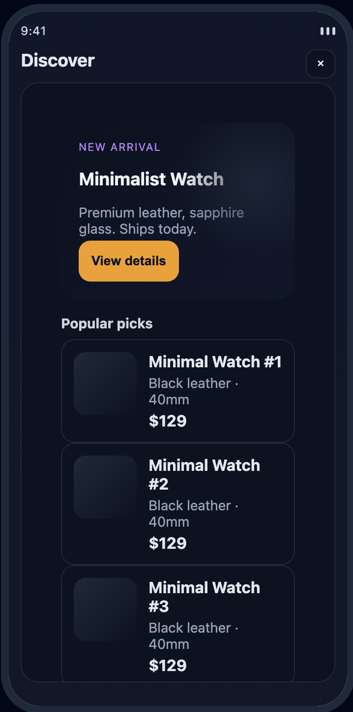
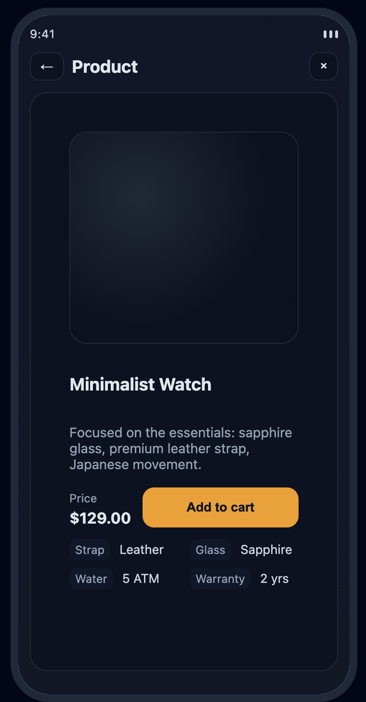
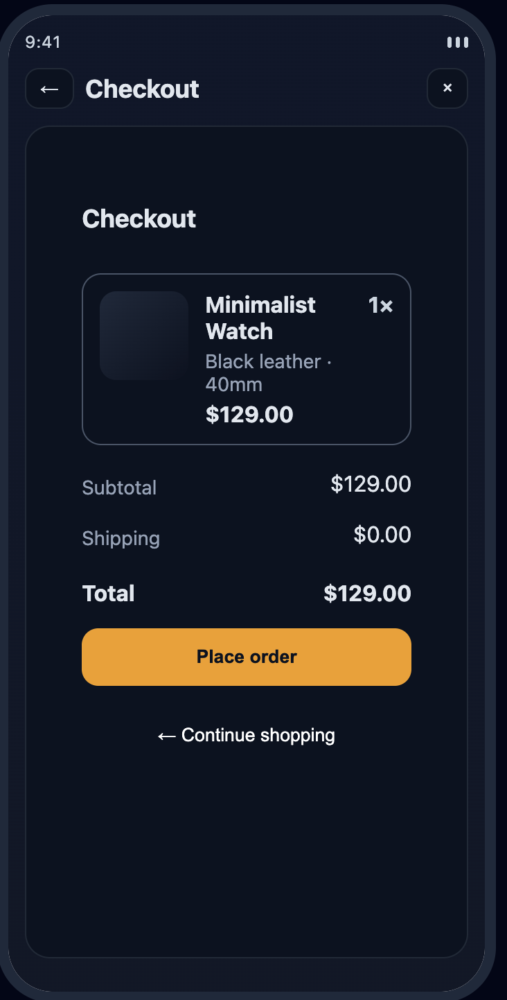
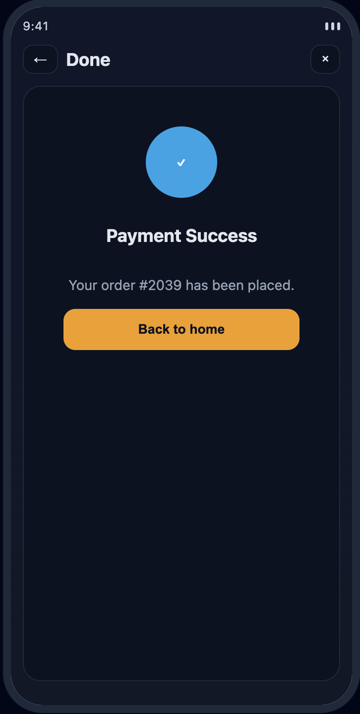
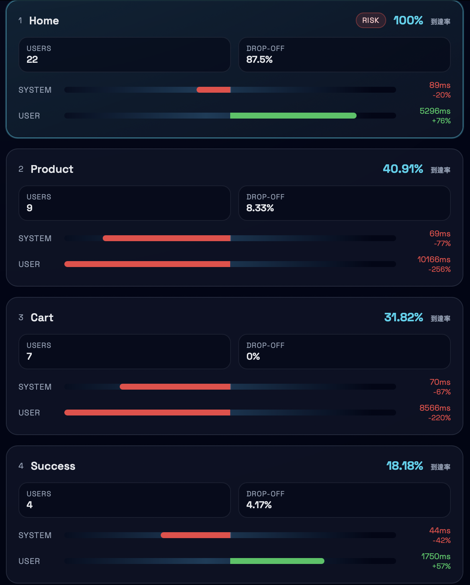
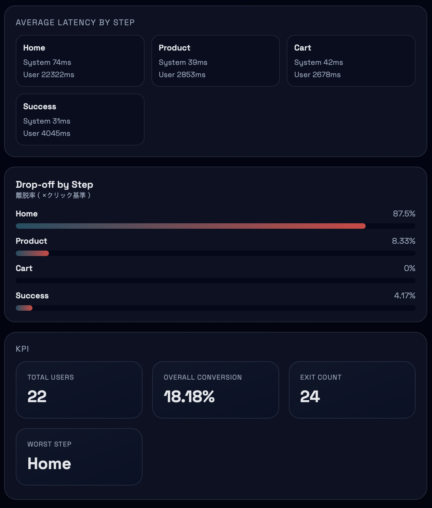
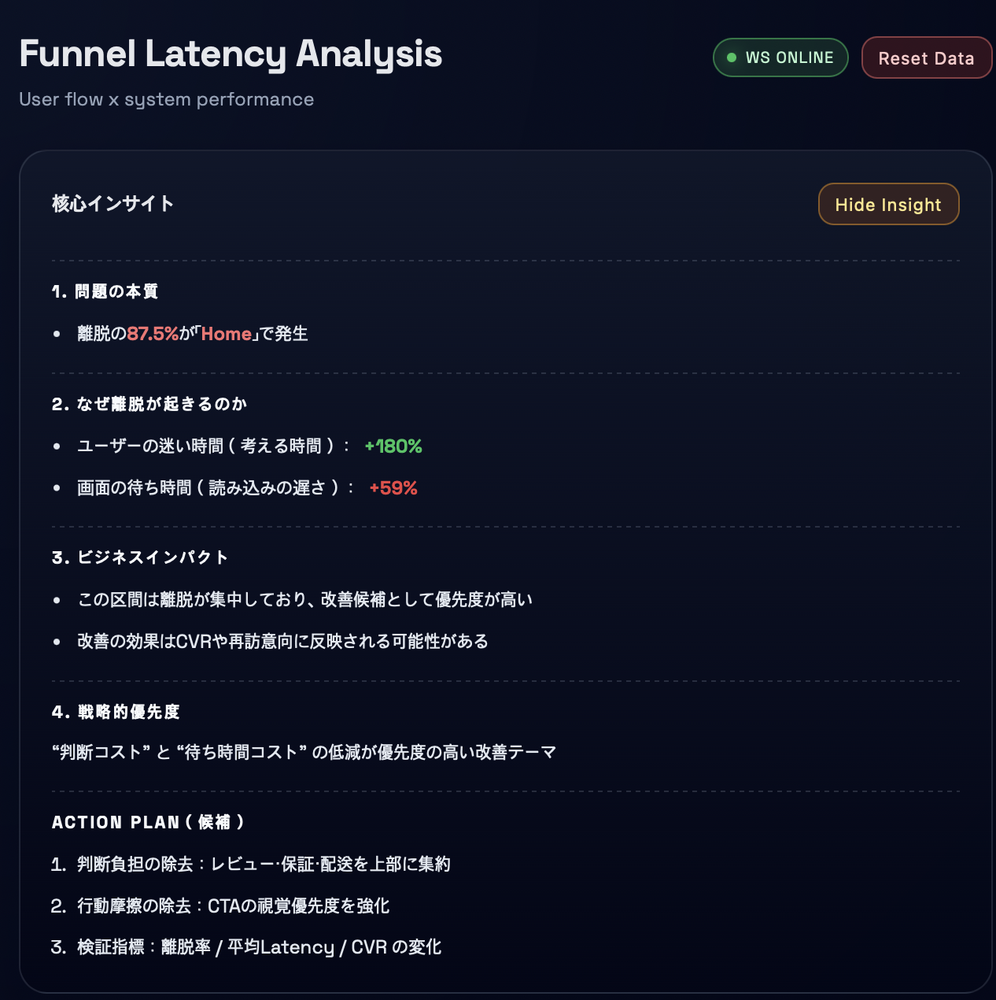

# User Punnel — リアルタイム顧客離脱分析ダッシュボード

左側はECフロー（ホーム → 商品 → カート → 成功/離脱）シミュレーター、右側はリアルタイムのファネル指標（離脱分布、コンバージョン率、レイテンシ）を表示するダッシュボードです。非エンジニアでも理解できるように、インサイトとアクションプランを併せて提供します。

---

## 主な機能
- **リアルタイムダッシュボード**（WebSocket `/ws/metrics`）
- **ステップ別の離脱分布**（全離脱 = 100%基準で配分）
- **レイテンシバー**（システム/ユーザー）、ステップ別平均を含む
- **Insight パネル**（コンサル風サマリー + アクションプラン）
- **Reset Data** ボタンでDBデータ初期化
- **Exit シミュレーション**（Xボタン → Exitページ、5分無操作で離脱記録）

---

## 技術スタック
- **Frontend**: React + Vite, Axios
- **Backend**: FastAPI, SQLAlchemy
- **Database**: PostgreSQL（`funnel_analytics`）
- **Realtime**: WebSocket（`/ws/metrics`）

---

## プロジェクト構成
```
backend/
  app/
    main.py              # FastAPI アプリ + WebSocket
    db.py                # SQLAlchemy 設定 + DB接続
    models/              # Event, Session, FunnelSnapshot
    routers/             # /events, /funnel, /sessions
    schemas.py           # Pydantic スキーマ
    ws_manager.py        # WebSocket マネージャ
frontend/
  src/
    App.jsx
    hooks/               # useFunnelMetrics, useLiveFunnel
    page/                # SimulatorPage, DashboardPage
    components/
      dashboard/         # FunnelPanel, FunnelRow, LatencyBar, InsightBox, DropoffChart
      simulator/         # Home/Product/Cart/Success/Exit
    services/            # API クライアント
    styles/              # dashboard.css, simulator.css
```

---

## 実行方法

### 1) バックエンド

`requirements.txt`
```
fastapi
uvicorn
sqlalchemy
psycopg2-binary
```

**インストールと起動**
```bash
cd backend
python -m venv .venv
source .venv/bin/activate
pip install -r ../requirements.txt

# PostgreSQL DB が必要:
#   DB名: funnel_analytics
#   URL: postgresql://localhost/funnel_analytics

uvicorn app.main:app --reload
```

### 2) フロントエンド
```bash
cd frontend
npm install
npm run dev
```

アクセス: `http://localhost:5173`

---

## 動作フロー（技術視点）

1. シミュレーターでイベントが発生すると `/events` に送信
2. バックエンドがDBへ保存後、`/funnel/summary` を計算
3. 計算結果を WebSocket でブロードキャスト
4. フロントエンドがリアルタイムでダッシュボード更新

**設計の要点**
- **WebSocket** により指標を即時反映し、体感を向上
- **イベント駆動設計**でステップ移動/離脱/レイテンシをすべて記録
- **サーバー/ユーザーレイテンシ分離**で原因切り分けが可能

---

## ビジネス観点の要約

このシステムは「どこで、なぜ、どれだけ」顧客が離脱するのかを即座に把握できます。
- **離脱分布**で最大の損失区間を迅速に特定
- **レイテンシ指標**でUX/システムのボトルネックを分離して分析
- **Insight パネル**で非エンジニアにも理解可能な改善方向を提示

つまり、技術指標を**意思決定できるビジネスインサイト**へ変換することが価値です。

---

## API サマリー

### `POST /events`
イベントを作成し、最新の要約データをブロードキャスト

**Payload**
```json
{
  "user_id": "user_xxxx",
  "screen": "home",
  "next_screen": "product",
  "event_type": "navigate",
  "user_think_time": 1200,
  "system_latency": 0,
  "timestamp": "2026-02-10T00:00:00.000Z"
}
```

### `POST /events/clear`
イベント/セッション/スナップショットテーブルを全削除し、ブロードキャスト

### `GET /funnel/summary`
ファネル要約指標を返却

### `WS /ws/metrics`
レイテンシ更新を受信
```json
{
  "type": "latency",
  "event_id": 123,
  "client_latency_ms": 220
}
```

---

## ファネル指標ロジック
- **ステップ別離脱率** = `該当ステップの離脱数 / 全離脱数 * 100`
- **到達率** = `該当ステップのユーザー数 / 全セッション数 * 100`
- **レイテンシ** = ステップ別の最新値 + 平均値

---

## スクリーンショット








---

## デモシナリオ

1. **Home → Product → Cart → Success** の順で進行
2. 途中で **Xボタン** を押して Exit 発生
3. 右側ダッシュボードで離脱分布とレイテンシ変化を確認
4. **Insight パネル** で改善提案を確認
5. **Reset Data** ボタンで初期化して繰り返しテスト

---

## 参考
- DB 接続文字列は `backend/app/db.py` にハードコード
- ダッシュボード上部に WS 接続状態バッジを表示

---

## ライセンス
MIT（必要に応じて変更可）
